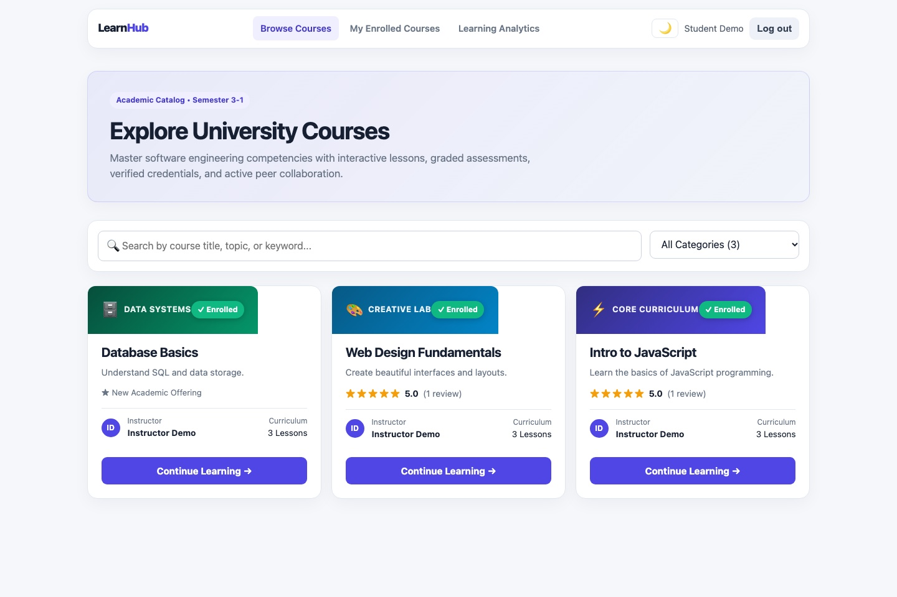
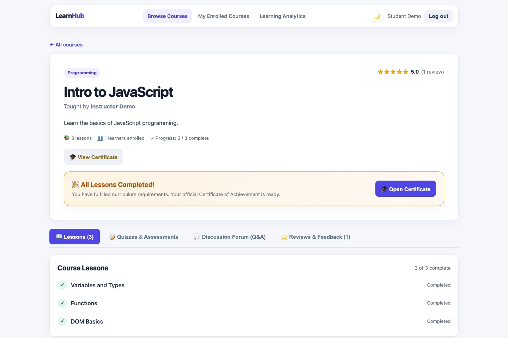
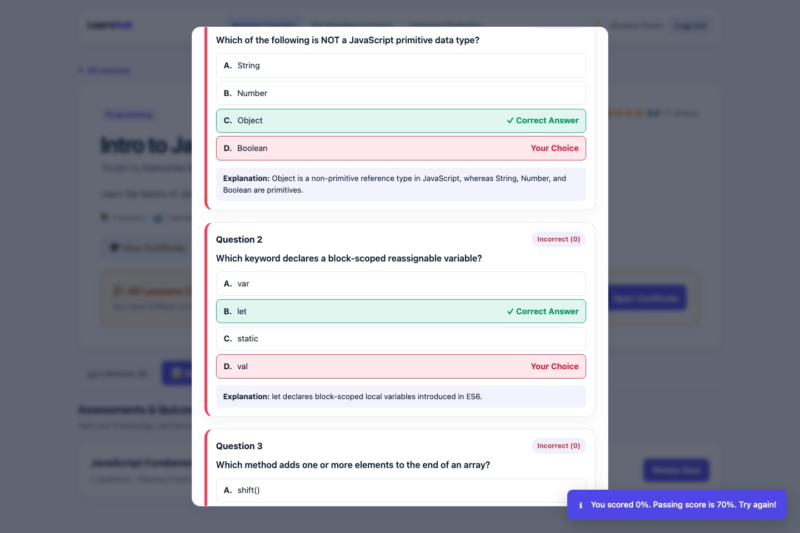
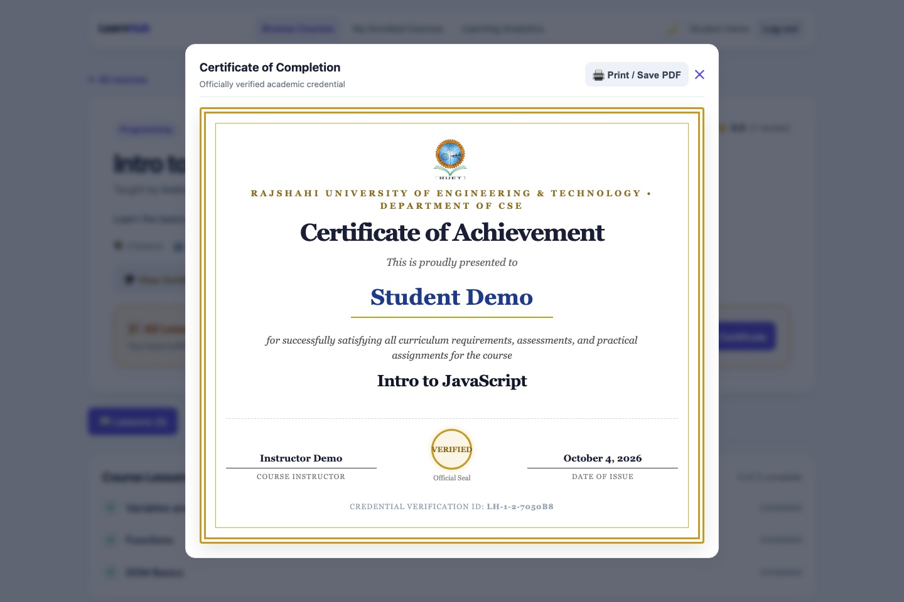
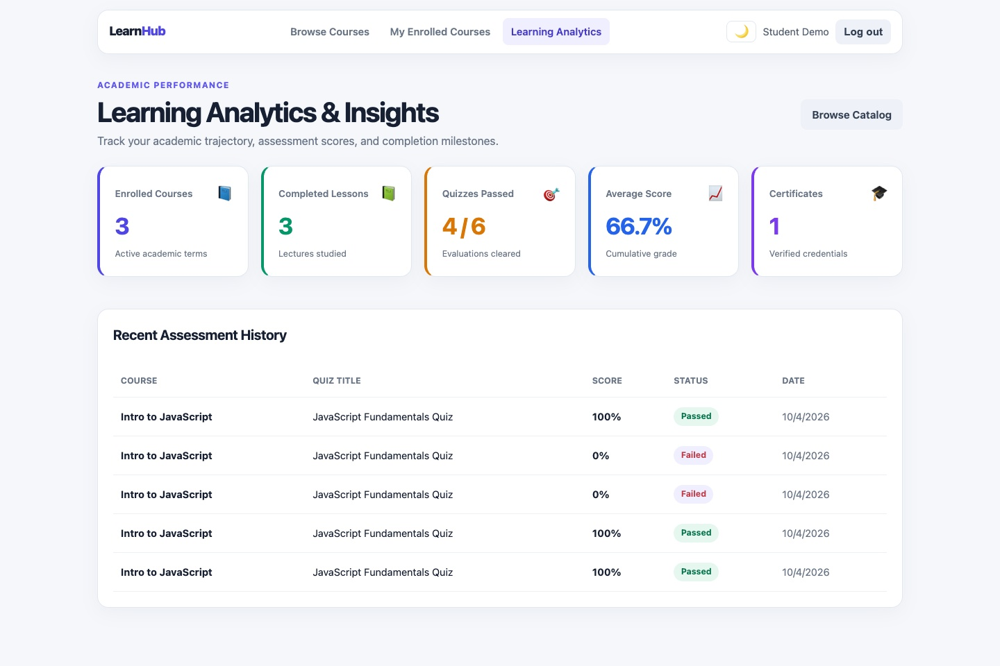

<div align="center">

# 🎓 LearnHub — University E-Learning Platform

**A Scalable Full-Stack Academic Learning Management System with Interactive Assessments, Verifiable Certification, and Community Collaboration**

[](https://nodejs.org)
[](https://expressjs.com)
[](https://react.dev)
[](https://vitejs.dev)
[](https://www.sqlite.org)
[](server/test_all_features.js)

<p align="center">
  <strong>Rajshahi University of Engineering & Technology (RUET)</strong><br>
  <strong>Department of Computer Science & Engineering (CSE)</strong><br>
  <em>Course Code: CSE 3206 | Course Title: Software Engineering Sessional</em><br>
  <em>Supervised by: <strong>Emrana Kabir Hashi</strong>, Assistant Professor, Department of CSE, RUET</em>
</p>

</div>

---

## 📖 Project Overview

**LearnHub** is an academic-grade, full-stack web application engineered for modern university computer science and engineering coursework. It bridges classroom instruction with automated, objective testing, verified credentials, and active peer-faculty interaction.

The platform eliminates the operational complexity and rigid workflows common in legacy LMS platforms (Moodle, Blackboard) through:
- **Fast Course Discovery & Curriculum Flow**: Instant keyword searching, academic discipline filtering, and ordered lesson consumption.
- **Interactive MCQ Assessment Engine**: Automated scoring, passing threshold enforcement (e.g. 70%), anti-cheating response sanitization, and explanatory pedagogical feedback.
- **Verifiable Digital Credentials**: Automatic qualification validation upon 100% course completion, issuing cryptographically unique certificate codes (`LH-<courseId>-<studentId>-<HEX>`) with an open, public verification endpoint.
- **Academic Performance Analytics**: Comprehensive student trajectory dashboards tracking enrolled terms, lectures studied, assessment scores, and chronological attempt histories.
- **Community Engagement**: Course-specific Q&A forums featuring official verified instructor reply badges, paired with 1-to-5 star student reviews and dynamic distribution histograms.
- **Dual-Theme Design System**: Sleek Light and Dark modes with persistent caching, glassmorphic UI cards, and non-intrusive animated toast notifications.

---

## 👥 Engineering Team & Contribution Matrix

Developed collaboratively for **CSE 3206: Software Engineering Sessional** by **Team Noob**:

| Member | Student Name | Roll / ID | Academic Role | Core Subsystem Contributions |
| :---: | :--- | :---: | :--- | :--- |
| **Member 1** | **Ashiqur Rahman** | **2203034** | *Assessment & Certification Lead* | • **Interactive MCQ Assessment Engine** & automated grading algorithm.<br>• **Post-test Answer Review Interface** with pedagogical explanations.<br>• **Verifiable Certificate of Achievement System** with public validation API (`/api/certificates/verify/:code`).<br>• **Printable Academic Diploma Layout** with official RUET emblem and seals.<br>• **Academic Learning Analytics Engine** & SQL aggregation queries. |
| **Member 2** | **Talha Jubair** | **2203035** | *Catalog & Core Architecture Lead* | • **LearnHub Application Shell**, routing, and responsive navigation.<br>• **Course Discovery Catalog** with query search and category filters.<br>• **Instructor Administration Dashboard** with course creation/editing.<br>• **Curriculum Lesson Authoring** with sequential position ordering.<br>• **Student Enrollment Access Control** & basic progression tracking. |
| **Member 3** | **Md. Rofaz Hasan Rafiu** | **2203036** | *Community, UI/UX & QA Lead* | • **Course Reviews & 5-Star Rating System** with distribution histograms.<br>• **Community Q&A Discussion Forum** with verified instructor answer badges.<br>• **Dual-Theme Engine** (Dark / Light Mode) with CSS custom properties.<br>• **Reactive Toast Notification System** & tabbed course hub architecture.<br>• **End-to-End Automated Test Harness** (`server/test_all_features.js`). |

---

## 📸 Visual Showcase & Platform Insights

All interface screenshots below are captured directly from the live running LearnHub application:

### 1. Platform Entrance & Authentication
Modern split-screen layout highlighting university-grade curricula, interactive assessments, and verifiable certificates. Features 1-click demo login buttons for rapid evaluator access.

<div align="center">
  
</div>

---

### 2. Academic Course Discovery Catalog
Searchable catalog featuring real-time text query filtering, academic discipline categories (Programming, Web Design, Data Systems), instructor avatars, and live student star ratings.

<div align="center">
  
</div>

---

### 3. Course Detail Hub & Tabbed Learning Experience
Organized into four interactive tabs: `📖 Lessons`, `📝 Quizzes & Assessments`, `💬 Discussion Forum`, and `⭐ Reviews & Feedback`. Features a prominent golden milestone banner upon completing all lessons.

<div align="center">
  
</div>

---

### 4. Interactive Assessment & Automated Grading Modal
Displays multiple-choice questions, computes percentage scores instantly, highlights correct answers in green, incorrect choices in crimson, and reveals pedagogical explanations.

<div align="center">
  
</div>

---

### 5. Official Verified Certificate of Completion
Authentic academic diploma featuring the official **RUET Coat of Arms**, Department of CSE header, graduate name, instructor signature, verified seal, issue date, and tamper-proof verification ID.

<div align="center">
  
</div>

---

### 6. Academic Learning Analytics Dashboard
Student trajectory dashboard presenting KPI metric cards (Enrolled Courses, Lectures Studied, Quizzes Passed, Cumulative Grade, Certificates) and an assessment history log.

<div align="center">
  
</div>

---

## 🏛️ System Architecture

LearnHub adheres to a three-tier decoupled architectural model:

```
+-------------------------------------------------------------------+
|                     PRESENTATION TIER (CLIENT)                    |
|  React 18 SPA | Vite Bundler | React Router 6 | Dual-Theme CSS    |
|  [AuthContext]   [ThemeContext]   [ToastContext]   [API Services] |
+-------------------------------------------------------------------+
                                  |
                                  | HTTP / REST (JSON Payloads)
                                  v
+-------------------------------------------------------------------+
|                   APPLICATION SERVICES TIER (API)                 |
|  Express.js Server | JWT Bearer Middleware | Input Sanitization   |
|  ---------------------------------------------------------------  |
|  /api/auth          /api/courses         /api/quizzes             |
|  /api/certificates  /api/analytics       /api/reviews             |
|  /api/discussions   /api/learning                                 |
+-------------------------------------------------------------------+
                                  |
                                  | Synchronous SQL Drivers (better-sqlite3)
                                  v
+-------------------------------------------------------------------+
|                      DATA PERSISTENCE TIER (DB)                   |
|  SQLite (learnhub.db) | 11 Normalized Relational Tables           |
|  Foreign Key Cascade Constraints | Unique Index Guards            |
+-------------------------------------------------------------------+
```

### Anti-Cheating Assessment Security
To protect academic integrity, when a student calls `GET /api/quizzes/:id`, the backend sanitizes the JSON response, stripping `correct_index` and `explanation`. Answer evaluation is executed exclusively on the backend upon receiving the student's submission at `POST /api/quizzes/:id/attempt`. Answer keys and pedagogical rationales are released only after the attempt is permanently recorded.

---

## 🗄️ Relational Database Schema

The database model comprises 11 interconnected tables enforcing strict integrity:

```
+---------------+          +------------------+          +-------------------+
|     users     | 1------* |     courses      | 1------* |      lessons      |
+---------------+          +------------------+          +-------------------+
        |                            |                             |
        | 1                          | 1                           | 1
        *                            *                             *
+---------------+          +------------------+          +-------------------+
|  enrollments  |          |     quizzes      |          |  lesson_progress  |
+---------------+          +------------------+          +-------------------+
        |                            |                             |
        | 1                          | 1                           |
        *                            *                             |
+---------------+          +------------------+                    |
| reviews & Q&A |          |  quiz_questions  |                    |
+---------------+          +------------------+                    |
        |                            |                             |
        |                            *                             |
        |                  +------------------+                    |
        +----------------> |   quiz_attempts  | <------------------+
                           +------------------+
                                     |
                                     | 100% Curriculum Audit
                                     v
                           +------------------+
                           |   certificates   |
                           +------------------+
```

| Table Name | Description | Key Constraints |
| :--- | :--- | :--- |
| `users` | Accounts, passwords, and roles | `email UNIQUE`, role in (`student`, `instructor`) |
| `courses` | Academic course metadata | `instructor_id` $\rightarrow$ `users(id)` ON DELETE CASCADE |
| `lessons` | Ordered curriculum reading content | `course_id` $\rightarrow$ `courses(id)`, `position INT` |
| `enrollments` | Student course registrations | `UNIQUE(student_id, course_id)` |
| `lesson_progress` | Audit logs for completed lessons | `UNIQUE(student_id, lesson_id)` |
| `quizzes` | Assessments and passing thresholds | `course_id` $\rightarrow$ `courses(id)`, `passing_score INT` |
| `quiz_questions` | MCQs with serialized JSON options | `quiz_id` $\rightarrow$ `quizzes(id)` ON DELETE CASCADE |
| `quiz_attempts` | Historical student exam attempts | `student_id` $\rightarrow$ `users`, `quiz_id` $\rightarrow$ `quizzes` |
| `certificates` | Issued credentials with unique codes | `UNIQUE(student_id, course_id)`, `certificate_code UNIQUE` |
| `reviews` | 1--5 star ratings and student feedback | `UNIQUE(student_id, course_id)` (one review per course) |
| `discussions` & `replies` | Threaded course Q&A community | `is_instructor` verification badge check |

---

## 🚀 Getting Started

### Prerequisites
- **Node.js**: v18.0.0 or higher
- **npm**: v9.0.0 or higher

### Installation

1. **Clone the repository**:
   ```bash
   git clone https://github.com/TalhaJubair35/SWE-lab-2-noob-project.git
   cd SWE-lab-2-noob-project
   ```

2. **Configure Environment Variables**:
   ```bash
   cp server/.env.example server/.env
   ```
   *(Defaults run on port 4000 with auto-seeded SQLite database)*

3. **Install Dependencies**:
   ```bash
   # Install server packages
   cd server && npm install

   # Install client packages
   cd ../client && npm install
   cd ..
   ```

4. **Launch the Development Servers**:
   - **Terminal 1 (Backend API)**:
     ```bash
     cd server && npm run dev
     ```
     *Server listens on `http://localhost:4000`*
   - **Terminal 2 (Frontend Client)**:
     ```bash
     cd client && npm run dev
     ```
     *Client runs on `http://localhost:5173`*

5. Open your web browser at **`http://localhost:5173`**.

---

## 🔑 Pre-Seeded Demonstration Accounts

For swift academic evaluation, the system pre-seeds sample courses, lessons, quizzes, discussions, and test users:

| Account Type | Email Address | Password | Intended Role |
| :--- | :--- | :--- | :--- |
| **Student Account** | `student@demo.com` | `Demo@123` | Browsing, taking quizzes, completing lessons, earning certificates |
| **Instructor Account** | `instructor@demo.com` | `Demo@123` | Course authoring, lesson structuring, quiz creation, Q&A replies |

*(Evaluators can also click the **🎓 Student Demo** or **👨‍🏫 Instructor Demo** 1-click buttons on the login card).*

---

## 🧪 Automated Testing & Verification

LearnHub includes a comprehensive, automated end-to-end integration test harness:

```bash
cd server
node test_all_features.js
```

### Verified Test Suites (10/10 Passing):
```
1. Testing Student Authentication...
✓ Student logged in: Student Demo (JWT issued)

2. Testing Course Catalog with Rating Aggregates...
✓ Fetched courses with average star ratings and review counts

3. Testing Course Quizzes Metadata Retrieval...
✓ Found active quiz: "JavaScript Fundamentals Quiz" (Passing score: 70%)

4. Testing Quiz Taking, Grading & Explanations...
✓ Quiz Attempt Result: Score = 100%, Passed = true (3/3 correct with feedback)

5. Testing Course Discussion Forum & Instructor Badges...
✓ Thread created and verified instructor reply confirmed

6. Testing Course Reviews & 5-Star Distribution...
✓ Review saved, average rating computed, distribution histogram updated

7. Testing Student Learning Analytics Engine...
✓ Analytics computed: courses enrolled, quizzes passed, average score

8. Completing all lessons for 100% Curriculum Audit...
✓ Completed all 3 lessons in "Intro to JavaScript"

9. Generating Verifiable Certificate of Completion...
✓ Certificate Issued! Code: LH-1-2-7050B8 (Student Demo - Intro to JavaScript)

10. Public Verification of Certificate Code...
✓ Public Verification Successful! Valid graduate name and course confirmed

=========================================
🎉 ALL INTEGRATION TESTS PASSED 100%!
=========================================
```

---

## 📡 RESTful API Reference

| HTTP Method | Endpoint Path | Access Level | Description | Key Subsystem |
| :--- | :--- | :--- | :--- | :--- |
| `POST` | `/api/auth/register` | Public | Register new student or instructor | Authentication |
| `POST` | `/api/auth/login` | Public | Sign in & receive Bearer JWT | Authentication |
| `GET` | `/api/auth/me` | Bearer Token | Retrieve active authenticated profile | Authentication |
| `GET` | `/api/courses` | Bearer Token | Course catalog with search & rating stats | Course Discovery |
| `POST` | `/api/courses` | Instructor | Create new academic course | Instructor Hub |
| `GET` | `/api/courses/:id` | Bearer Token | Fetch full course details & syllabus | Course Discovery |
| `POST` | `/api/courses/:id/enroll` | Student | Register student into course | Enrollment Flow |
| `GET` | `/api/courses/:id/lessons`| Enrolled | List ordered lessons with progress | Curriculum Flow |
| `POST` | `/api/lessons/:id/progress`| Student | Mark lesson as completed | Curriculum Flow |
| `GET` | `/api/courses/:id/quizzes`| Enrolled | List course quizzes with attempt history | Assessment Engine |
| `GET` | `/api/quizzes/:id` | Enrolled | Fetch questions (answers sanitized) | Assessment Engine |
| `POST` | `/api/quizzes/:id/attempt`| Student | Submit answers & receive instant grade | Assessment Engine |
| `POST` | `/api/courses/:id/quizzes`| Instructor | Author new assessment with MCQs | Assessment Engine |
| `GET` | `/api/courses/:id/certificate`| Student | Audit 100% completion & issue cert | Certification Engine |
| `GET` | `/api/certificates/verify/:code`| **Public** | **Open third-party validation of credential** | Certification Engine |
| `GET` | `/api/analytics/overview`| Bearer Token | Real-time student/instructor KPI stats | Analytics Engine |
| `GET` | `/api/courses/:id/reviews`| Bearer Token | Fetch reviews & 5-star histogram | Peer Reviews |
| `POST` | `/api/courses/:id/reviews`| Enrolled | Submit or update 1-to-5 star rating | Peer Reviews |
| `GET` | `/api/courses/:id/discussions`| Enrolled | List course discussion threads | Community Forum |
| `POST` | `/api/courses/:id/discussions`| Enrolled | Post new discussion question | Community Forum |
| `POST` | `/api/discussions/:id/replies`| Enrolled | Reply to thread (verified instructor check) | Community Forum |

---

## 📁 Repository Directory Structure

```
SWE-lab-2-noob-project/
├── client/                     # Frontend React 18 Application (Vite)
│   ├── public/                 # Static assets (RUET logo, favicon)
│   ├── src/
│   │   ├── api/                # API client services (courses, quizzes, certs, etc.)
│   │   ├── components/         # Shared UI: Navbar, StarRating, Spinner, ErrorMessage
│   │   ├── context/            # AuthContext, ThemeContext (Dark/Light), ToastContext
│   │   ├── features/           # Feature-driven modules:
│   │   │   ├── analytics/      # Academic Learning Analytics Dashboard
│   │   │   ├── certificates/   # Certificate of Completion Modal & Print layout
│   │   │   ├── courses/        # CourseListPage, CourseFormPage, InstructorDashboard
│   │   │   ├── discussions/    # CourseDiscussionTab & Thread Q&A
│   │   │   ├── learning/       # CourseDetailPage, MyCoursesPage, LessonPage
│   │   │   ├── quizzes/        # CourseQuizzesTab, QuizModal, InstructorQuizModal
│   │   │   └── reviews/        # CourseReviewsTab & 5-star distribution histograms
│   │   ├── index.css           # Modern design system, CSS variables & animations
│   │   └── main.jsx            # React root mount & providers
├── server/                     # Backend REST API Application (Node/Express)
│   ├── src/
│   │   ├── common/             # AppError, asyncHandler, authentication middlewares
│   │   ├── config/             # Environment variables and port configurations
│   │   ├── db/                 # SQLite connection, schema.sql, deterministic seeder
│   │   ├── modules/            # Domain routes: auth, courses, learning, quizzes,
│   │   │                       # certificates, analytics, reviews, discussions
│   │   ├── app.js              # Express application assembly & route mounting
│   │   └── server.js           # HTTP listener bootstrap
│   ├── capture_real_screenshots.js # Puppeteer real screenshot automation
│   └── test_all_features.js    # 10-stage automated integration test harness
└── docs/                       # Project Documentation & Reports
    ├── demo-script.md          # 5-minute live demonstration script for evaluators
    └── report/                 # Academic LaTeX Lab Report 2
        ├── figures/            # High-resolution real application screenshots
        ├── LearnHub_LaTeX_Report_Overleaf.zip # Ready-to-upload Overleaf package
        └── report.tex          # Formal 10-chapter academic report source
```

---

## 📄 License & Academic Declaration

This project was developed for the **Software Engineering Sessional (CSE 3206)** laboratory curriculum at **Rajshahi University of Engineering & Technology (RUET)**. All code and documentation reflect original engineering work conducted by Team Noob.
